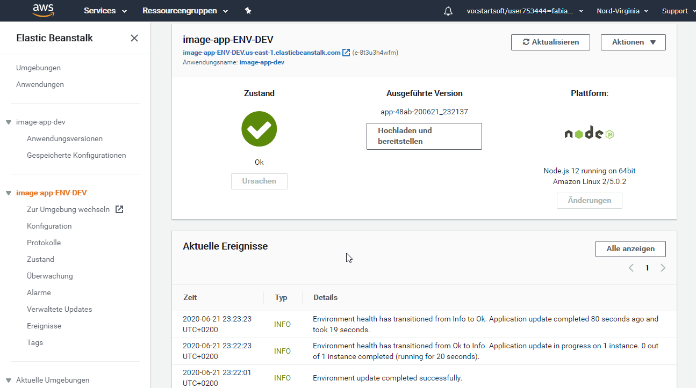
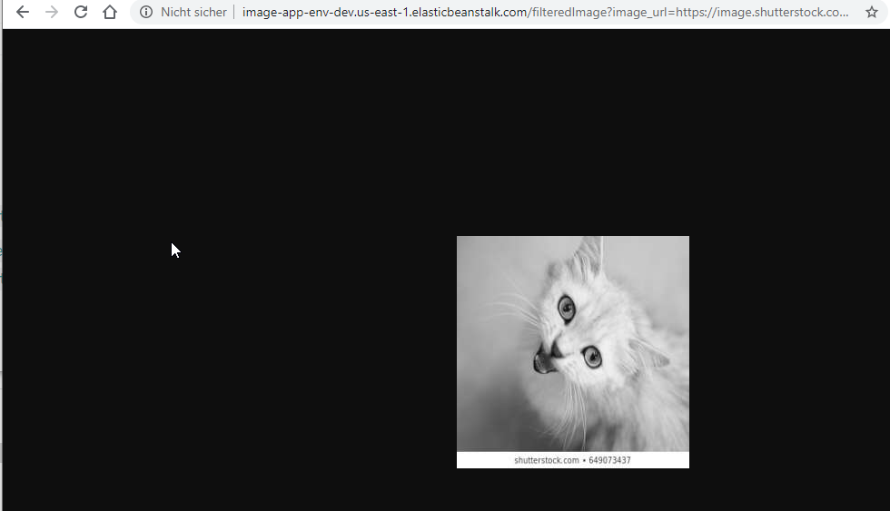

# Dashboard

# Endpoint

- Run locally `http://localhost:8082/filteredImage?image_url=https://image.shutterstock.com/image-photo/cat-260nw-649073437.jpg` or 
- Run via AWS EB `http://image-app-env-dev.us-east-1.elasticbeanstalk.com/filteredImage?image_url=https://image.shutterstock.com/image-photo/cat-260nw-649073437.jpg`

Solution image:

